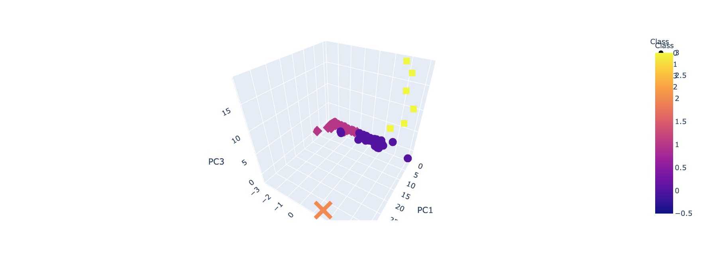
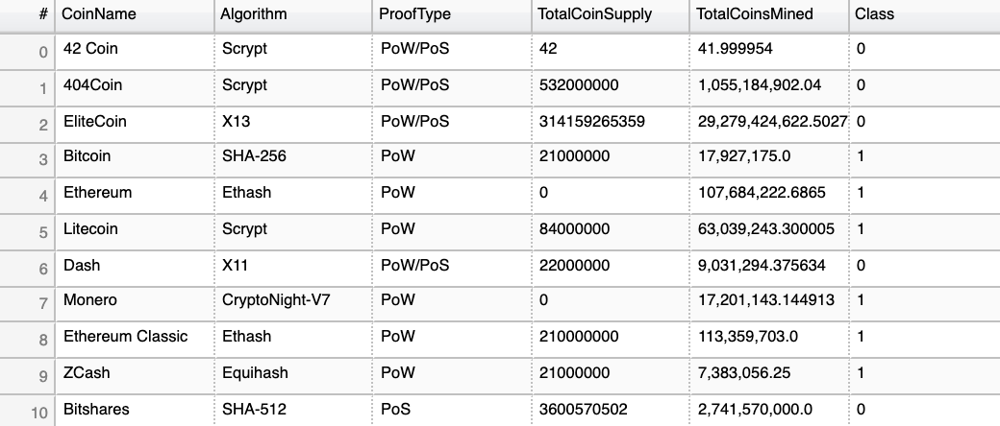
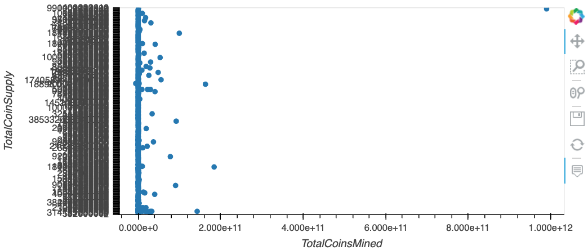

# Unit 13 Challenge - Clustering Crypto 

Notebook code: [Notebook](https://github.com/jcurvone/unit13-challenge/blob/master/ClusteringCrypto/crypto_classification.ipynb)

## Data Prep

Data was imported from the csv file provided and prepared step by step as recommended in the starter file notebook. 

When using **OneHotEncoder** it was necessary to create two separates dataframes and then concatenate twice to bring all the dummies and data together. 

## K-Means 

The elbow curve indicated that 4 clusters would be the best cost-benefit efficient selection for the K-Means model. 

## Final Results 

